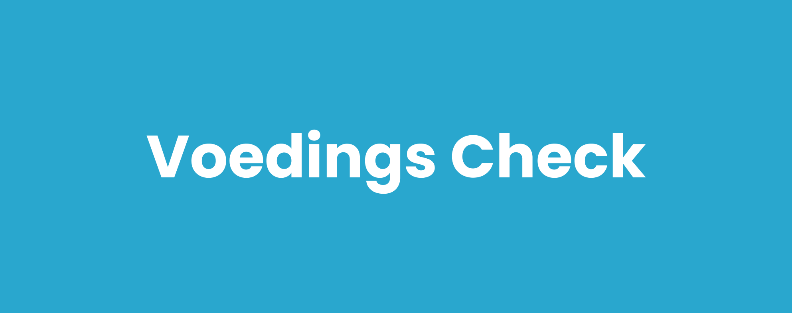
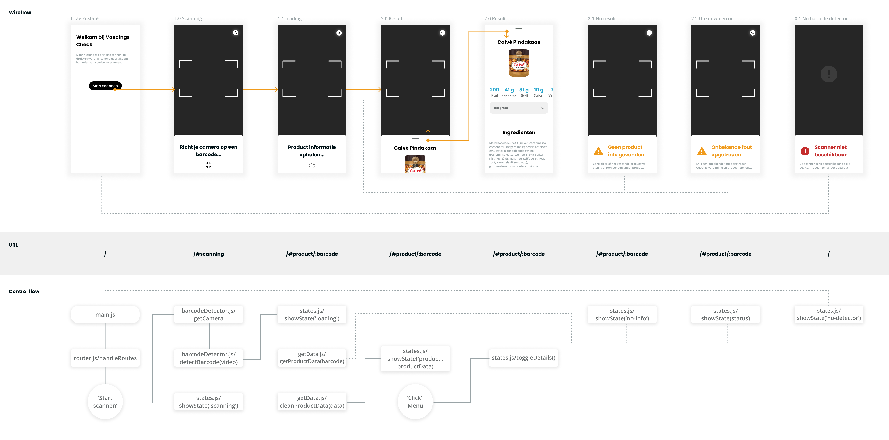

<!-- in wiki -->

# 🥜 Voedings Check

## 🌟 Over Voedings Check

Voedings Check is een applicatie om eten en drinken met een barcode te kunnen scannen. Door deze producten te scannen kom je erachter wat de voedingswaarden & ingrediënten hiervan zijn, waardoor het je kan helpen om een gezondere of betere keuze te maken.

## 📝 Table of contents

-   User Story
-   Features
-   Hoe gebruik ik de applicatie?
-   Live demo
-   Todo's
-   Activity Diagram
-   API's
-   License

## 📖 User Story

Als foodie, wil ik tijdens het boodschappen doen een product kunnen scannen, zodat ik meer informatie over het product kan lezen en een goede keuze kan maken die bij mijn dieet past.

## 🛠 Features

-   Producten met barcode scannen
-   Product info bekijken
-   Voedingswaarden ophalen
-   Ingrediënten bekijken

## 🤔 Hoe gebruik ik de applicatie?

Je gebruikt Voedings Check door op de live demo hieronder te klikken. Vervolgens kun je op de knop 'Start scannen' drukken om te beginnen. Na het geven van toestemming voor het gebruik van je camera kun je barcodes van producten voor je camera houden. Wanneer iets gescand is krijg je de product informatie te zien. Mocht er geen product info beschikbaar zijn of ondersteunt jouw browser de barcode scanner niet dan krijg je hier een melding over.

## 🌐 Live demo

Probeer de applicatie zelf uit op: https://markvheusden.github.io/voedings-check/.

## ✅ Todo's

-   Scanner werkend maken op meer browsers (zoals Safari)
-   Zoekfunctie toevoegen
-   Meer product info weergeven / koppelen aan jouw dieët

## 📊 Activity Diagram

## 🗄️ API's

-   Barcode Detection API (https://developer.mozilla.org/en-US/docs/Web/API/Barcode_Detection_API)
-   Open Food World API (https://world.openfoodfacts.org/data)

## 🔏 License

MIT
